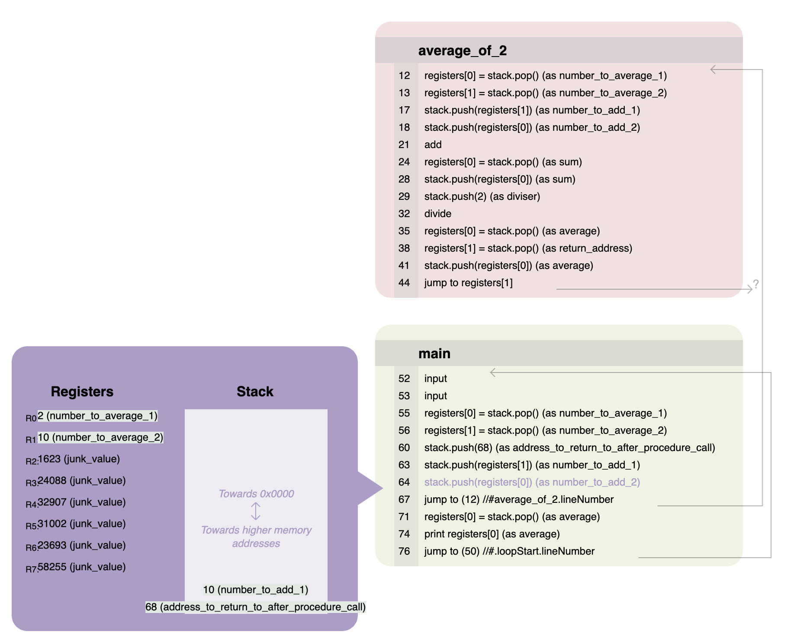

# StackDemoLang

Demo: https://anirudh.katoch.co/StackDemoLang
(Hit Run, then keep clicking the page to move forward one instruction at a time)

I learned programming by first learning a high level language and then much later learning about assembly and actual machine code that stuff compiles to.
It was a steep learning curve for me and it took me a while to understand.
StackDemoLang is a language which has the same principles as low level machine language / assembly.
Hopefully it will help others learn stuff more quickly than I learned it

- it has registers and a stack
- it has jump instructions, no loops or if statements
- it does not have "expressions"

But it takes away the scary parts and makes things super easy to reason about
- the jump addresses are just line numbers
- calling conventions are stated via explicit "contracts", so we end up both demonstrating the need for and practical examples of calling conventions as part of procedure definition
- We can give registers and stack values temporary names that show up during the visualization process
- the VM that runs the code comes with visualization of the entire state and runs things one instruction at a time

This makes it ideal for demonstration purposes or for learning how things work on the low level without having to worry about understanding the more arcane aspects of low level programming.

For example, here's a valid program that calls a subroutine to average two numbers:
```
    //Average the numbers using a subroutine:
        //Prepare the return address the subroutine should come back to after it's done:
        stack.push(#.after_averaging_jump_here.lineNumber) (as address_to_return_to_after_procedure_call)

        //Prepare the arguments (the numbers to average) for the subroutine
        stack.push(registers[1]) (as number_to_add_1)
        stack.push(registers[0]) (as number_to_add_2)

        //Jump to the subroutine
        jump to #average_of_2.lineNumber
        #LABEL: .after_averaging_jump_here

        //Process the output of the subroutine, which it left for us on the stack
        registers[0] = stack.pop() (as average)
```

The calling convention is that we push two numbers and the return address to the stack.
The subroutine itself explicitly states this calling convention (very verbosely):

```
define_procedure average_of_2
contract
{
    I promise to pop 3 elements (the numbers to average and the return address) and push 1 element (their average) on the stack
    I promise to preserve the value of all registers except: registers[0], registers[1]
}
body
{
    //Get the arguments (except the return address)
    registers[0] = stack.pop() (as number_to_average_1)
    registers[1] = stack.pop() (as number_to_average_2)
    ...
    ...
}
```

This code is direclty picked up from `examples/average_of_2.stackdemo`
(See the `examples` folder for more example programs)

The program gets run and visualized by the visualizer one instruction at a time:



# The language

The language grammar is defined in StackDemoLang.g4, for use with ANTLR4
https://github.com/antlr/antlr4

Example programs are provided in the examples folder

The reference for the language... I have not written yet, but the examples should get you started.

# Lexing and parsing

Lexer, parser, visitor/listener for the language can be generated by ANTLR

```shell
antlr4 -Dlanguage=JavaScript ./StackDemoLang.g4 -o browser_runtime/src/codegen
```
(This will generate a lexer and parser in javascript)

These generated files have dependencies on the common lexing and parsing runtime provided by ANTLR
This runtime for the parser can be downloaded from the ANTLR website, or from NPM

e.g. `wget http://www.antlr.org/download/antlr-javascript-runtime-4.10.1.zip`
or `npm i antlr4`

The package StackDemoLangRuntime already has antlr4 as a dependency

# Language runtime

The language runtime is a virtual machine written in javascript as well (in interpreter.js)

This virtual machine is modelled after a very simplified and generic CPU processor, with registers and a stack.

It has some custom features to help visualization and aid conceptualization.

The virtual machine, as well as the language interpreter, can be run with nodeJS locally
```
cd browser_runtime
node . ../examples/average_of_3.stackdemo
```

It can also be run on a browser using webpack.
```
cd browser_runtime
npx webpack
open dist/index.html
```

# Building

```shell
antlr4 -Dlanguage=JavaScript ./StackDemoLang.g4 -o browser_runtime/src/codegen
( cd browser_runtime ; npm install ; node . )
```

## Docker

The Dockerfile is provided in the root directory can be used to generate the browser based html runtime
```shell
docker build . -t stackdemolang
docker run -i -v "$PWD/examples":/examples stackdemolang /examples/average_of_3.stackdemo
```

## CI/CD

Pushing to the `main` git branch on github deploys github-actions and makes the demo application available on `anirudh.katoch.co/StackDemoLang`

# Debugging

Easiest way to debug the grammar is using the antlr test rig
```shell
grun()
{
   java -Xmx500M -cp "/usr/local/lib/antlr-4.10.1-complete.jar:$CLASSPATH" org.antlr.v4.gui.TestRig "$@"
}
antlr4 ./StackDemoLang.g4 -o java && (cd java ; javac *.java ; grun StackDemoLang program -tokens -gui -tree ../examples/example_program.stackdemo)
```

The way to debug the semantic parser and interpreter, is to debug via nodeJS + chrome devTools
```shell
antlr4 -Dlanguage=JavaScript ./StackDemoLang.g4 -o browser_runtime/src/codegen
( cd browser_runtime ; node --inspect-brk . )
```
